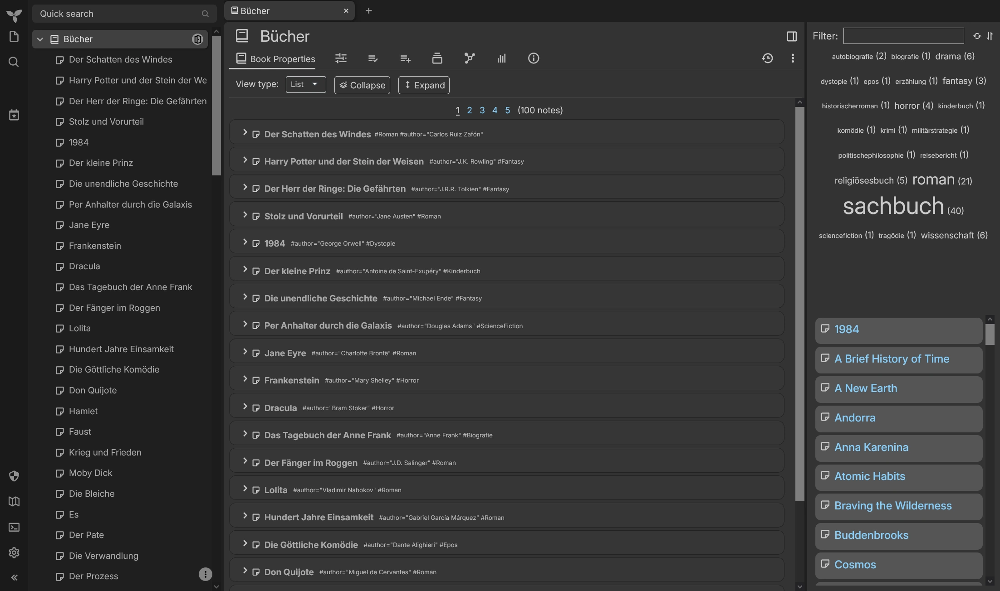

# TriliumNext Notes Label Attribute Cloud Widget
Show Label Attributes for books as a tag cloud with search and filter options on the right

Written for TrilliumNext Notes v0.101.0

## Sample Image

## How to install
* Create a code note of type JS frontend and give it a #widget label 
* Copy the text of code.js in it
* Reload or restart Trillium

## Using
To activate the widget add the attribute #showCloud to the book you want to show the tag cloud on the right.

### Attributes
The Widget uses the following attributes for control:
* "#showCloud": Activates the widget on the book [default: off]
* "#cloudIgnore": Adds the value to the list of ignored attributes (can used multiple times) [default: "viewType" and all control attributes of this widget]
* "#cloudFlipShowCount": Changes the default behavior for showing the attribute count to the opposite [default: show count]

### In code variables/constants
This is for advanced users who know how to change code and want to tweak the widget. Any changes here will affect the control [Attributes](#Attributes).

The following in code constants can be edited to change the default behavior:
* "CloudDefaultShowCount": Show the count for the attributes
* "CloudDefaultSortAttributeByWeight": Set the default sorting of the cloud to sort by weight (true) or by name (false)
* "CloudDefaultIgnoredAttributes": Hide this attributes in the cloud (needs to be in lowercase!)

This constants defines the names of the attributes the widget uses for control:
* "CloudActivateAttribute": Name of the attribute to activate the widget
* "CloudIgnoredAttribute": Name of the attribute for additional attributes to ignore
* "CloudFlipShowCount": Name of the attribute to flip the default of CloudDefaultShowCount
